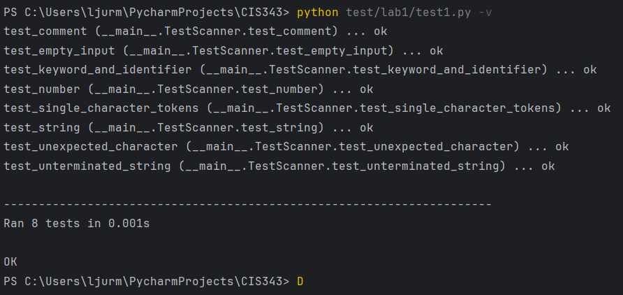

Lab 1 Report:

Language name: still thinking about one, but I will use "Spaghetti" for now

regexes used: include all numbers [0-9]+(\.[0-9]+)?, all strings "[^"]*", and all identfiers [A-Za-z_][A-Za-z0-9_]*

how to use: Just use python src/spaghetti.py in terminal for repl, or add a file on the end as well to run from that file, such as python src/spaghetti.py example_code.spaghetti. For the tests, just run test1.py in the lab1 test folder

design choices relative to lox: As of now, I pretty much just followed chapter 4 of the book and the slides pretty heavily, and didn't really make too many of my own decisions. I followed the same keywords, operatos, and pretty much everything else so far. However, once I have a bit more time and get more familiar with this whole process, I plan on going back a little bit and adding some additions, such as more keywords or operators that have funny or niche use cases. For now, I plan on keeping things pretty straightforward and similar to lox for easier development and understanding.

test cases: listed under tests/lab1, they should be pretty comprehensive. Not really sure if I need to exactly explain every one of them since they are unittests and pretty self explanatory, but I will quickly summarize them:

Test 1: check that scanner detects a series of single character tokens

2: test to make sure it can detect numbers

3: check for strings

4: check for keywords and identifiers 

5: check for comments

6: check for unexpected characters

7: test for unterminated strings

8: check for nothing being entered

Limitations: many advanced features are not included, such as scientific notation. However, I probably have some obscure bug that I will find later in the next labs 
